<h1 align="center">Xin chào, tôi là Minh Phú 👋</h1>

  Một Web Developer nhiệt huyết, luôn tìm kiếm những giải pháp tối ưu và sáng tạo.

  <a href="https://facebook.com/<tên_tài_khoản_FB_của_bạn>" target="blank"></a>
  <a href="mailto:<email_của_bạn>@gmail.com" target="blank"></a>

---

### 🧑‍💻 Về tôi

Tôi đam mê xây dựng các hệ thống quản lý và ứng dụng web. Hiện tại, tôi đang tập trung vào việc trau dồi kỹ năng với các công nghệ như Java (cho dự án Tennis), React, và Laravel.

- 🔭 Tôi đang làm việc trên dự án: **<Hệ thống Quản lý Gara ô tô>**
- 🌱 Tôi đang học thêm về: **<ReactJS và Microservices>**
- 👯 Tôi mong muốn hợp tác về: **<Dự án mã nguồn mở>**
- 💬 Hãy hỏi tôi về: **<Java, Cấu trúc dữ liệu và Giải thuật>**

### 🛠️ Kỹ năng

  
  
  
  
  
  

### 📊 Thống kê GitHub

  
  

---

Rất vui được kết nối với bạn!

